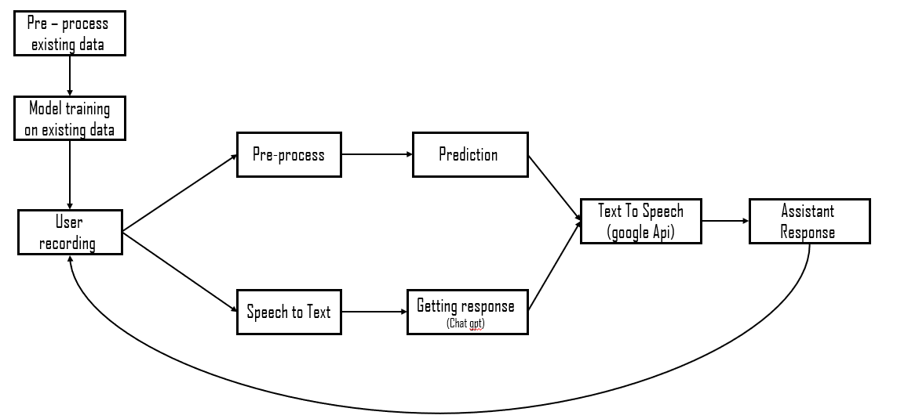

# MirrorTalk

## Overview
MirrorTalk is an machine learning project that personalizes your AI assistant's response based on your vocal input. This dynamic system adjusts the assistant's tone to match yours: whispering when you whisper, speaking in a regular tone when you talk normally, and responding loudly if you raise your voice. This provides a more intuitive and responsive user experience, making interactions with AI feel more natural and engaging.

The core of MirrorTalk utilizes a Random Forest model to predict the appropriate response mode based on three voice types:
1. **W** - Whisper audio
2. **R** - Regular audio
3. **L** - Loud audio

## Project Flow
The system follows this workflow:

The flow begins with pre-processing existing data for model training.
When a user interacts with the system, their voice is recorded,
transformed via Speech to Text (for getting response by ChatGpt),
and pre-processed. The model then predicts the appropriate response tone,
which guides the Text to Speech engine (using Google API) to deliver the assistant's response
in the predicted voice tone.

## Setup Instructions
To run the MirrorTalk project,
you need to set up several environment variables that allow integration with Google Cloud and OpenAI services.
Here are the necessary steps:

### Prerequisites
- Access to Google Cloud services
- An OpenAI account

### Environment Variables
You need to define the following environment variables in your system:

- `GOOGLE_APPLICATION_CREDENTIALS`: Set this to '1' for initial setup.
- `OPENAI_API_KEY`: Insert your OpenAI API key here.
- `PYTHONUNBUFFERED`: This should be the path to your Google credentials JSON file.

